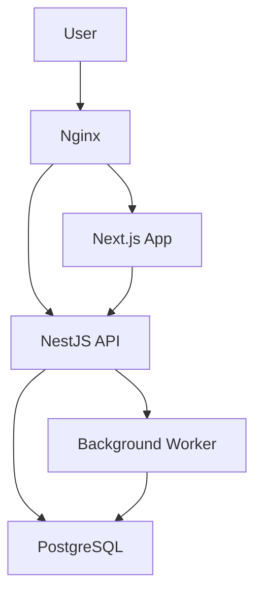

# Phase 02 — Enterprise Architecture

> High-level enterprise architecture blueprint for Triangle Black.

## Architecture Overview

```
┌───────────────────────────────────────────────────────────────────────────────┐
│                           CLIENT LAYER                                        │
│  ┌─────────────────┐  ┌─────────────────┐  ┌──────────────────────┐          │
│  │   Next.js App    │  │   PWA Mobile    │  │   Third-Party APIs   │          │
│  │   (Web Browser)   │  │   (Field Ops)   │  │   (ETA, Bank, etc.)  │          │
│  └────────┬─────────┘  └────────┬─────────┘  └──────────┬───────────┘          │
│           │                     │                        │                      │
├───────────┼─────────────────────┼────────────────────────┼──────────────────────┤
│           │          API GATEWAY (Nginx + NestJS)        │                      │
│           │                     │                        │                      │
├───────────┼─────────────────────┼────────────────────────┼──────────────────────┤
│           ▼                     ▼                        ▼                      │
│  ┌──────────────────────────────────────────────────────────────────────┐      │
│  │                        SERVICE LAYER (NestJS)                        │      │
│  │                                                                      │      │
│  │  Auth    │ Commercial │ Project  │ Procure  │ Financial │           │      │
│  │  Module  │  Module    │ Module   │  Module  │  Module   │  ...      │      │
│  │         │            │          │          │           │           │      │
│  └──────────────────────────────────────────────────────────────────────┘      │
│                              │                                                  │
├──────────────────────────────┼──────────────────────────────────────────────────┤
│                              ▼                                                  │
│  ┌──────────────────────────────────────────────────────────────────────┐      │
│  │                      DATA LAYER (PostgreSQL + Prisma)                 │      │
│  │                                                                      │      │
│  │  Tenant A Schema │ Tenant B Schema │ Tenant C Schema │ Shared Schema │      │
│  └──────────────────────────────────────────────────────────────────────┘      │
│                                                                               │
├───────────────────────────────────────────────────────────────────────────────┤
│  ┌────────────────────────────────────────────────────────────────────────┐   │
│  │                      INFRASTRUCTURE (Docker Compose)                    │   │
│  │  Nginx │ NestJS API │ Next.js Web │ PostgreSQL │ Worker (Background)   │   │
│  └────────────────────────────────────────────────────────────────────────┘   │
└───────────────────────────────────────────────────────────────────────────────┘
```

## Technology Stack

| Layer | Technology | Version | Rationale |
|-------|-----------|---------|-----------|
| Frontend | Next.js (App Router) | 15 | SSR, SSG, React ecosystem |
| Backend | NestJS | 11 | Enterprise patterns, TypeScript |
| ORM | Prisma | 6 | Type-safe, schema-first |
| Database | PostgreSQL | 16 | Mature, extensible |
| Auth | JWT (access + refresh) | — | Simple, no infra dependency |
| Runtime | Node.js | 22 LTS | LTS, performance |
| Container | Docker Compose | — | Single host, simple orchestration |
| Web Server | Nginx | — | Reverse proxy, SSL termination |
| CI/CD | GitHub Actions | — | Repository integration |

## Architecture Principles

See `01-ARCHITECTURE-PRINCIPLES.md` for the full 20-principle set. Key highlights:

1. **Schema-per-tenant**: Each customer isolated in their own PostgreSQL schema
2. **Domain-driven**: Modules organized by business capability
3. **API-first**: All capabilities exposed via REST; no direct DB from frontend
4. **Event-driven**: Cross-domain communication via events
5. **Startup budget**: Single VPS, self-hosted, no paid middleware

## Deployment Architecture



## Related Documents

- [Backend Architecture](Backend-Architecture.md)
- [Frontend Architecture](Frontend-Architecture.md)
- [Database Architecture](Database-Architecture.md)
- [API Architecture](API-Architecture.md)
- [DevOps Architecture](DevOps-Architecture.md)
- [Repository Architecture](Repository-Architecture.md)
